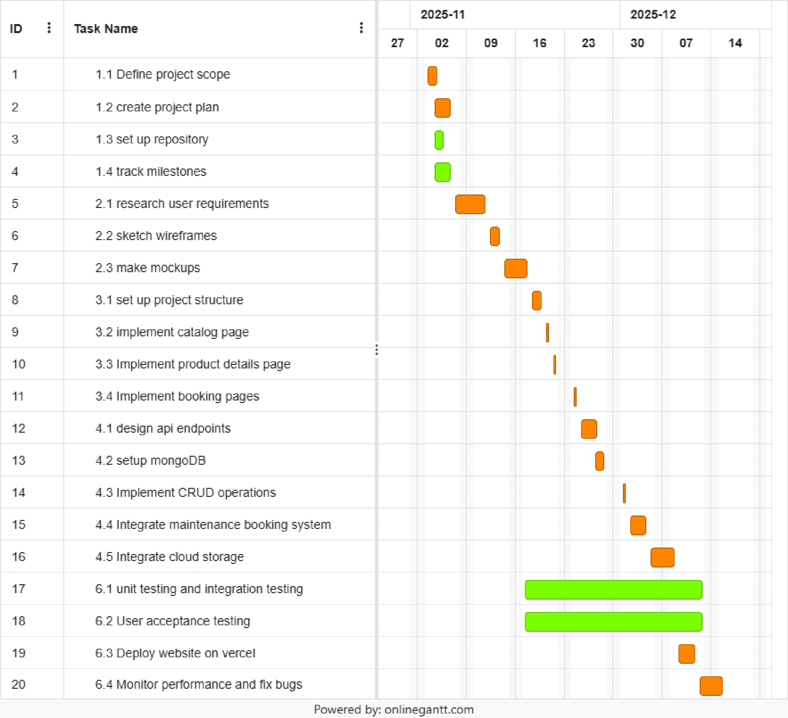
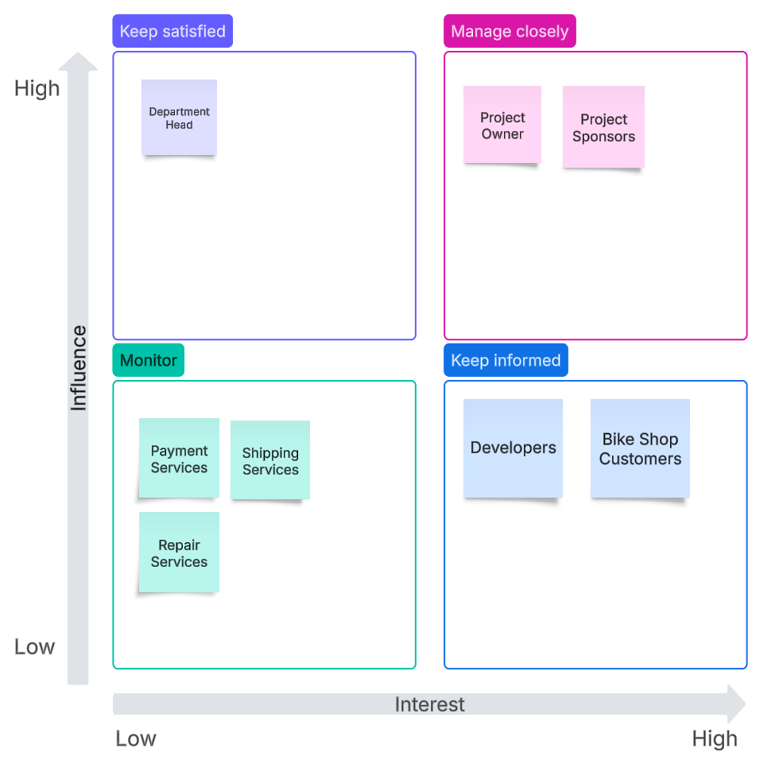

# Project Charter

## 1. Introduction

This project aims at creating a modern and fully functional e-commerce website for a local bike shop. The website will allow customers to browse bikes, accessories, and parts, check availability, and make secure online purchases. It will also include tools for booking maintenance services, scheduling test rides, and directly contacting the shop.  

The main goal is to provide a digital platform that enhances customer experience and expands the shop’s reach to a wider audience through a convenient, accessible, and user-friendly website.  

**Date:** October 6th, 2025  
**Current Version:** 1.0  
**Project Manager (and Sponsor):** Ali Khoshnoudian  

---

## 2. Overview

Ali is planning to develop his own website that will serve as an online marketplace and service booking system for both customers and the shop’s management. It will provide easy access to products, services, and promotions, improving customer satisfaction and sales efficiency.  

### 2.1 Objective

A fully functional e-commerce website will be up and running by the end of the term, featuring:

- A product catalog with detailed descriptions and images  
- A secure online payment system  
- Booking functionality for maintenance services and test rides  
- Admin tools for product and service management  
- Responsive and modern design accessible on all devices  

---

## 3. Milestones

- Decide on technologies for front-end (Next.js, React, Tailwind CSS), back-end (FastAPI), database (MongoDB), and services (Stripe for payments, Cloudinary for media, Vercel for deployment). Set up the project repository with proper branch structure and initial configuration.  
- Plan and sketch UI/UX on Figma for key pages such as Home, Product Catalog, Product Details, Booking, and Contact. Create mockups and component hierarchy to guide development.  
- Design API endpoints, database schema, and data flow. Outline how products, orders, and bookings will be stored and retrieved, ensuring security and scalability.  
- Determine how Stripe payments will work and how Cloudinary will store and serve product images. Document secure handling of environment variables and credentials.  
- Outline how users will book maintenance services and test rides. Define deployment steps on Vercel and how end-to-end testing will be conducted once development starts.  

### 3.1 Work Breakdown Structure

### 3.2 Requirements Traceability Matrix
| Req ID | Requirement | Del ID | Deliverable | Owner | Status |
|----------|----------|----------|----------|----------|----------|
| REQ01 | Users can register and log in | DEL01 | User, Authentication System | Developers | done |
| REQ02 | Users can browse bike collection with filters | DEL02 | Bike collection | Developers | done |
| REQ03 | Users can add bikes to shopping cart | DEL03 | Shopping Cart | Developers | in progress |
| REQ04 | Users can place an order and play | DEL04 | Order and Payment | Developers | in progress |

---

## 4. Deliverables

- Website deployed on Vercel (initial launch)  
- Fully functional product catalog and shopping cart  
- Secure Stripe payment gateway  
- Maintenance and test ride booking system  
- Admin panel for managing products and services  

### 4.1 Gantt Chart

For this mockup, Nov 02-09 is week 1, 09-16 is week 2, 16-23 is week 3, 23-30 is week 4, 30-07 is week 5, and 07-14 is week 6

---

## 5. Preliminary Budget
### 5.1 Personnel Cost Per Sprint

| **Role**             | **Rate**            | **Allocation** | **Burn Rate (CAD)**        | **Sprint Days**         | **Sprint Cost**       |
| -------------------- | ------------------- | ------------- | ------------------------    |  ---------------------: | ---------------------:|                        
| Product Owner        |             $300/day |            50% |              **$150/day** |             7           |            $1,050    |             
| Back End Developer   |             $200/day |           100% |              **$200/day** |             7           |            $1,400    |          
| Front End Developer  |             $150/day |           100% |              **$150/day** |               7         |            $1,050    |             
| **Total**            |                    — |              — |              **$500/day** |              7          |            $3,500    |              

### 5.2 Total Personnel Cost

Total Sprints = 6
Cost per Sprint = $3,500

**Total Personnel Cost** = $3,500 × 6 = $21,000 CAD

### 5.3 Fixed Costs (6 Weeks = 1.5 months)

| Item                     | Qtd |   Cost/Item | Notes             |  Total Cost |
| ------------------------ | --: | ----------: | ----------------- | ----------: |
| Hosting                  |   1 | $4.99/month | 4.99 × 1.5 months |       $7.49 |
| Cloud Database           |   1 |   $10/month | 10 × 1.5 months   |      $15.00 |
| Deployment (Vercel)      |   1 |   $20/month | 20 × 1.5 months   |      $30.00 |
| Design Tools (Figma)     |   1 |   $12/month | 12 × 1.5 months   |      $18.00 |
| Project Management Tools |   1 |   $12/month | 12 × 1.5 months   |      $18.00 |
| Domain                   |   1 | $12.99/year | Full year counted |      $12.99 |
| **Total Fixed Costs**    |   — |           — | —                 | **$101.48** |

### 5.4 Contigency

Contingency rate = 10%

Contingency = 10% × (Total Personnel + Fixed Costs)
Total Personnel = $21,000
Fixed Costs = $101.48
Total Base Cost = $21,101.48

Contingency = 0.10 × 21,101.48 = $2,110.15 CAD

### 5.5 Total Estimated Cost

| Category             |         Cost (CAD) |
| -------------------- | -----------------: |
| Total Personnel Cost |         $21,000.00 |
| Total Fixed Costs    |            $101.48 |
| Contingency (10%)    |          $2,110.15 |
| **Grand Total**      | **$23,211.63 CAD** |

---

## 6. Organization and Stakeholders

### 6.1 Stakeholders Analysis Matrix

### 6.2 Communications Plan

## Communications Plan

| Stakeholder Group                        | Communication Method        | Frequency           | Purpose / Content                                  | Owner               |
|-----------------------------------------|----------------------------|-------------------|--------------------------------------------------|-------------------|
| Project Owner, Project Sponsors         | Email / Zoom Meetings       | Weekly            | Project status updates, milestones, budget, key risks | Project Manager    |
| Team Lead  | Bi-weekly         | Summary of progress, high-level issues           | Project Manager    |
| Developers, Customers  | Slack / Email / Demo Sessions | Weekly / As Needed | Development updates, feature releases, testing feedback | Project Manager / Team Leads |
| Payment, Shipping, Repair Services | Email / Notifications | Monthly | System integrations, service updates, downtime notices | Project Manager    |

## 7. Risks, Assumptions, and Constraints
_To be added later._
